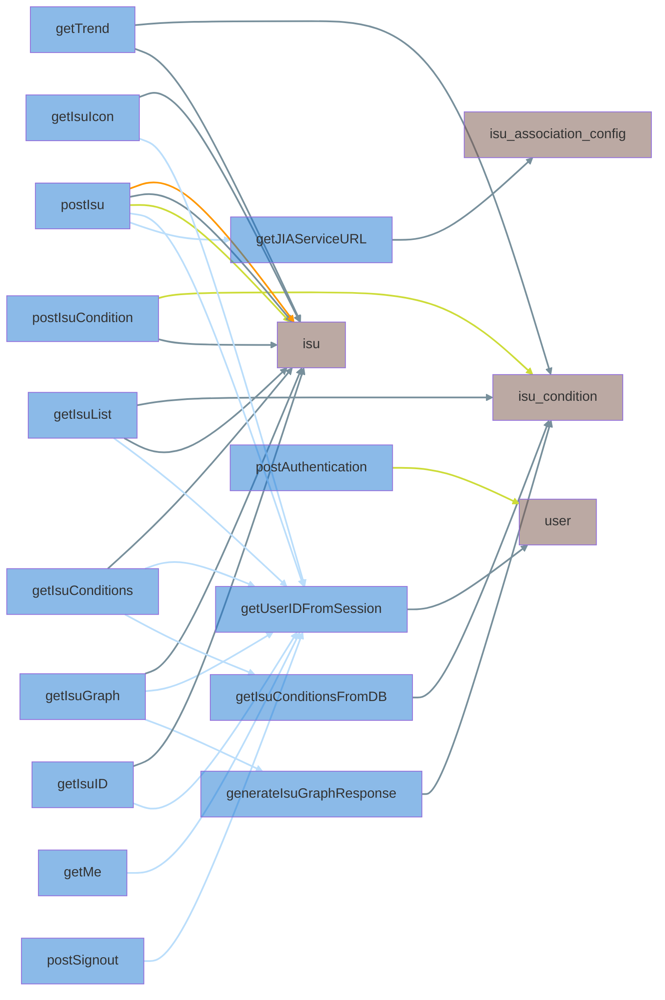

# DB Graph

```mermaid
graph LR
  classDef func fill:#1976D2,fill-opacity:0.5
  classDef table fill:#795548,fill-opacity:0.5
  func:github.com/isucon/isucon11-qualify/isucondition.postIsuCondition[postIsuCondition]:::func --> table:isu[isu]:::table
  func:github.com/isucon/isucon11-qualify/isucondition.postIsuCondition[postIsuCondition]:::func --> table:isu_condition[isu_condition]:::table
  func:github.com/isucon/isucon11-qualify/isucondition.getIsuGraph[getIsuGraph]:::func --> func:github.com/isucon/isucon11-qualify/isucondition.generateIsuGraphResponse[generateIsuGraphResponse]:::func
  func:github.com/isucon/isucon11-qualify/isucondition.getIsuGraph[getIsuGraph]:::func --> func:github.com/isucon/isucon11-qualify/isucondition.getUserIDFromSession[getUserIDFromSession]:::func
  func:github.com/isucon/isucon11-qualify/isucondition.getIsuGraph[getIsuGraph]:::func --> table:isu[isu]:::table
  func:github.com/isucon/isucon11-qualify/isucondition.getUserIDFromSession[getUserIDFromSession]:::func --> table:user[user]:::table
  func:github.com/isucon/isucon11-qualify/isucondition.getIsuID[getIsuID]:::func --> func:github.com/isucon/isucon11-qualify/isucondition.getUserIDFromSession[getUserIDFromSession]:::func
  func:github.com/isucon/isucon11-qualify/isucondition.getIsuID[getIsuID]:::func --> table:isu[isu]:::table
  func:github.com/isucon/isucon11-qualify/isucondition.getIsuConditions[getIsuConditions]:::func --> func:github.com/isucon/isucon11-qualify/isucondition.getIsuConditionsFromDB[getIsuConditionsFromDB]:::func
  func:github.com/isucon/isucon11-qualify/isucondition.getIsuConditions[getIsuConditions]:::func --> func:github.com/isucon/isucon11-qualify/isucondition.getUserIDFromSession[getUserIDFromSession]:::func
  func:github.com/isucon/isucon11-qualify/isucondition.getIsuConditions[getIsuConditions]:::func --> table:isu[isu]:::table
  func:github.com/isucon/isucon11-qualify/isucondition.getJIAServiceURL[getJIAServiceURL]:::func --> table:isu_association_config[isu_association_config]:::table
  func:github.com/isucon/isucon11-qualify/isucondition.postSignout[postSignout]:::func --> func:github.com/isucon/isucon11-qualify/isucondition.getUserIDFromSession[getUserIDFromSession]:::func
  func:github.com/isucon/isucon11-qualify/isucondition.getMe[getMe]:::func --> func:github.com/isucon/isucon11-qualify/isucondition.getUserIDFromSession[getUserIDFromSession]:::func
  func:github.com/isucon/isucon11-qualify/isucondition.getIsuList[getIsuList]:::func --> func:github.com/isucon/isucon11-qualify/isucondition.getUserIDFromSession[getUserIDFromSession]:::func
  func:github.com/isucon/isucon11-qualify/isucondition.getIsuList[getIsuList]:::func --> table:isu[isu]:::table
  func:github.com/isucon/isucon11-qualify/isucondition.getIsuList[getIsuList]:::func --> table:isu_condition[isu_condition]:::table
  func:github.com/isucon/isucon11-qualify/isucondition.getIsuConditionsFromDB[getIsuConditionsFromDB]:::func --> table:isu_condition[isu_condition]:::table
  func:github.com/isucon/isucon11-qualify/isucondition.postIsu[postIsu]:::func --> func:github.com/isucon/isucon11-qualify/isucondition.getJIAServiceURL[getJIAServiceURL]:::func
  func:github.com/isucon/isucon11-qualify/isucondition.postIsu[postIsu]:::func --> func:github.com/isucon/isucon11-qualify/isucondition.getUserIDFromSession[getUserIDFromSession]:::func
  func:github.com/isucon/isucon11-qualify/isucondition.postIsu[postIsu]:::func --> table:isu[isu]:::table
  func:github.com/isucon/isucon11-qualify/isucondition.postIsu[postIsu]:::func --> table:isu[isu]:::table
  func:github.com/isucon/isucon11-qualify/isucondition.postIsu[postIsu]:::func --> table:isu[isu]:::table
  func:github.com/isucon/isucon11-qualify/isucondition.getIsuIcon[getIsuIcon]:::func --> func:github.com/isucon/isucon11-qualify/isucondition.getUserIDFromSession[getUserIDFromSession]:::func
  func:github.com/isucon/isucon11-qualify/isucondition.getIsuIcon[getIsuIcon]:::func --> table:isu[isu]:::table
  func:github.com/isucon/isucon11-qualify/isucondition.postAuthentication[postAuthentication]:::func --> table:user[user]:::table
  func:github.com/isucon/isucon11-qualify/isucondition.getTrend[getTrend]:::func --> table:isu[isu]:::table
  func:github.com/isucon/isucon11-qualify/isucondition.getTrend[getTrend]:::func --> table:isu_condition[isu_condition]:::table
  func:github.com/isucon/isucon11-qualify/isucondition.generateIsuGraphResponse[generateIsuGraphResponse]:::func --> table:isu_condition[isu_condition]:::table
  linkStyle 1,20,25 stroke:#CDDC39,stroke-width:2px
  linkStyle 0,4,5,7,10,11,15,16,17,21,24,26,27,28 stroke:#78909C,stroke-width:2px
  linkStyle 22 stroke:#FF9800,stroke-width:2px
  linkStyle 2,3,6,8,9,12,13,14,18,19,23 stroke:#BBDEFB,stroke-width:2px
```